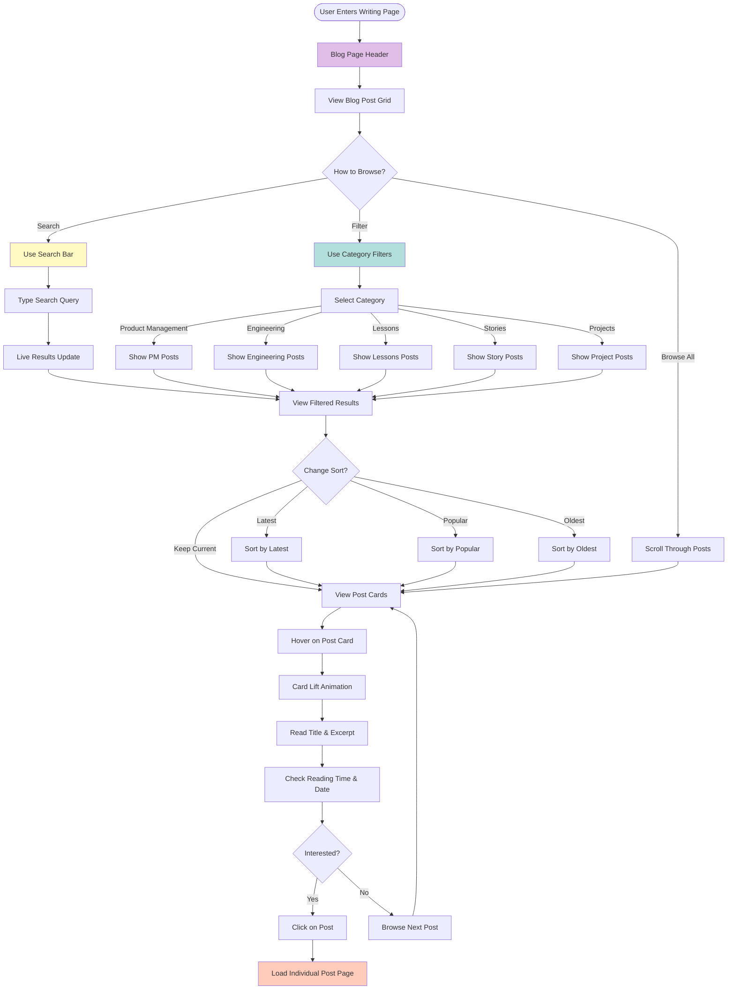

# User Flow Diagrams

This document visualizes the user journeys and interactions across the portfolio website using Mermaid diagrams.

---

## 1. Overall Site Navigation Flow

---

## 2. Homepage User Journey

---

## 3. Blog/Writing Page User Flow

---

## 4. Individual Blog Post User Flow

---

## 5. Contact Page User Flow

---

## 6. Newsletter Signup Flow

---

## 7. Mobile Navigation Flow

---

## 8. Theme Toggle Flow

---

## 9. Search & Filter Flow (Blog)

---

## 10. Content Engagement Flow

---

## Flow Diagram Summary

These user flows cover:

1. **Overall Site Navigation** - High-level navigation between pages
2. **Homepage Journey** - Detailed flow through homepage sections
3. **Blog/Writing Page** - Browsing and filtering blog content
4. **Individual Blog Post** - Reading experience and interactions
5. **Contact Page** - Form submission and alternative contact methods
6. **Newsletter Signup** - Complete subscription funnel
7. **Mobile Navigation** - Touch-optimized mobile experience
8. **Theme Toggle** - Light/dark mode switching
9. **Search & Filter** - Content discovery mechanisms
10. **Content Engagement** - Visitor-to-advocate journey

Each flow follows the features outlined in the feature specification and visualizes user decision points, interactions, and outcomes using Mermaid syntax.
